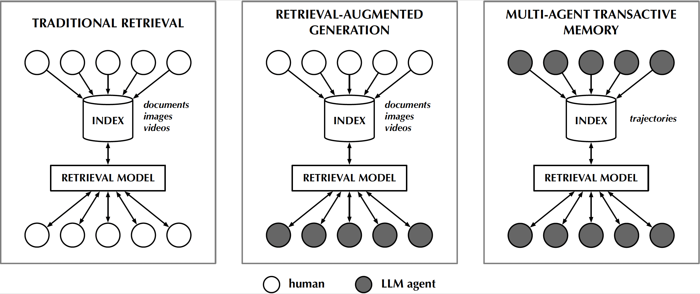
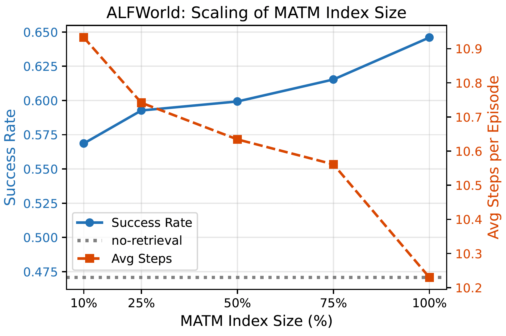
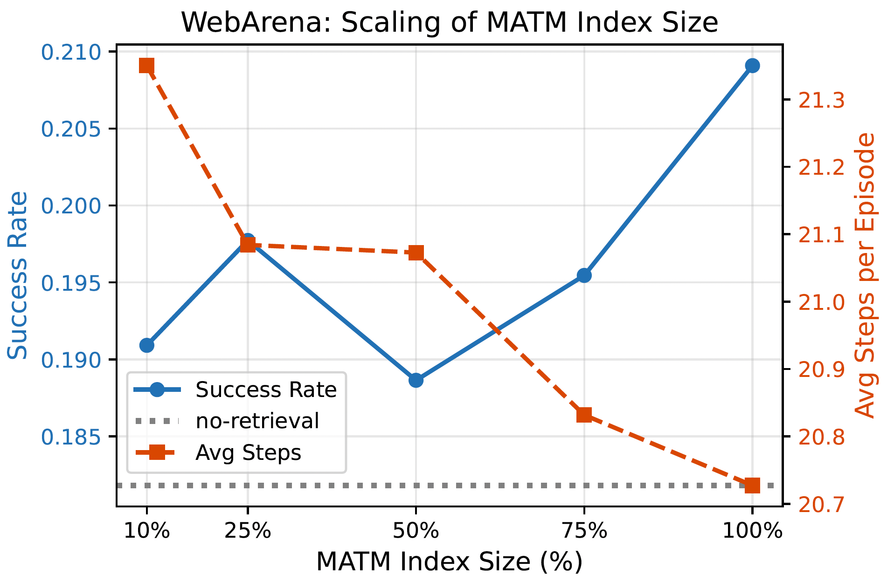

# Multi-Agent Transactive Memory (MATM)

[](https://arxiv.org/abs/2606.19911)
[](https://huggingface.co/datasets/toeunkim/matm-trajectories)
[](LICENSE)

**MATM** is a framework for population-level storage and retrieval of
agent-generated action-observation trajectories. *Producer agents* contribute
trajectories to a shared repository; *consumer agents* retrieve relevant
trajectory segments at inference time to improve task execution. Agents can
serve both roles without coordination or joint training.

<p align="center">
  
</p>

```
                          ┌────────────────────────────────────────┐
                          │        Shared Trajectory Repository    │
                          │   ┌─────────┐  ┌─────────┐  ┌───────┐  │
                          │   │ chunk 1 │  │ chunk 2 │  │  ...  │  │
                          │   └─────────┘  └─────────┘  └───────┘  │
                          └──────────▲───────────────┬─────────────┘
                                     │               │
                            index trajectories   retrieve top-k
                                     │               │
                            ┌────────┴────┐     ┌────▼────────┐
                            │  Producer   │     │  Consumer   │
                            │   Agents    │     │   Agents    │
                            │ (generate)  │     │  (utilize)  │
                            └─────────────┘     └─────────────┘
```


**Key components**:
- **Population-level memory sharing**: heterogeneous producer agents contribute
  trajectories to a shared repository that consumer agents query at inference,
  enabling collective experience reuse without coordination or joint training.
- **State-conditioned indexing**: trajectories are chunked with window size
  W=5 (key = task description + last 5 action-observation steps; value = next
  5 steps).
- **LTRT (learning-to-rank trajectories) reranker**: Rerankers trained on marginal-utility labels
  (outcome improvement vs. no-retrieval baseline), using 44 features show further improvement of performance of consumer agents that participates in the MATM framework. 
  Three ranker families were trained: FFN (pointwise), LambdaMART (pairwise), and SVMRank (pairwise).


## Contents

- [Main Results](#main-results)
- [Released Artifacts](#released-artifacts)
- [Repository Structure](#repository-structure)
- [Installation](#installation)
- [Configuration](#configuration)
- [Building the Shared Trajectory Index](#building-the-shared-trajectory-index)
- [Running Evaluation](#running-evaluation)
- [LTR Pipeline](#ltr-pipeline)
- [Trajectory Dataset](#trajectory-dataset)
- [Citation](#citation)
- [License](#license)


## Main Results
**Benchmarks**: ALFWorld (text-based household tasks) and WebArena (web-based
tasks).

<p style="text-align: center;"><strong>MATM improves both effectiveness and efficiency.</strong></p>
Evaluation of MATM-augmented agents across 34 consumer models (averaged over five
runs with randomized task–model allocation). SR = success rate; RPP = return-paired preference (joint success–efficiency metric; higher is better). 
Best per column in **bold**.

| Method | ALFWorld SR↑ | ALFWorld # steps↓ | ALFWorld RPP↑ | WebArena SR↑ | WebArena # steps↓ | WebArena RPP↑ |
|---|---:|---:|---:|---:|---:|---:|
| no retrieval | 0.4708 | 11.7664 | −0.1586 | 0.1818 | 21.9886 | −0.0511 |
| single-stage | 0.5511 | 11.1796 | −0.0451 | **0.2045** | 20.2614 | 0.0284 |
| rerank-FFN | 0.5861 | 11.0336 | −0.0046 | **0.2045** | **19.9091** | **0.0398** |
| rerank-LambdaMART | 0.5715 | 10.8474 | 0.0608 | 0.1818 | 20.4205 | −0.0341 |
| rerank-SVMRank | **0.6431** | **10.3453** | **0.1474** | **0.2045** | 20.2841 | 0.0170 |

Retrieval from the shared MATM repository consistently improves both effectiveness
and efficiency over the no-retrieval baseline. On ALFWorld, single-stage retrieval
raises success rate from 47% to 55%; LTR reranking with SVMRank further boosts it
to 64% while reducing average steps to 10.3. On WebArena, gains are more modest
(single-stage and rerank-FFN reach 20.5% SR vs. 18.2% baseline), reflecting longer
task horizons and greater sensitivity to early-step errors.

<p style="text-align: center;"><strong>MATM scales.</strong></p>
Consumer agent performance improves as the MATM index grows. 
On ALFWorld, success rate and step efficiency improve monotonically from 10% to 100% of the full index. 
WebArena shows a similar overall trend.

<p align="center">
  
  &nbsp;
  
</p>

<p style="text-align: center;"><strong>Other findings.</strong></p>

- Whether the consumer model is strong or weak, MATM provides benefits.  

- MATM offers cross-task generalization.

For more results and analyses, see our [paper](https://arxiv.org/abs/2606.19911).

## Released Artifacts

**[LTRT (learning-to-rank trajectories) models](ltr/ltr_models)**

| Model | File path |
|---|---|
| ALFWorld FFN | `ltr/ltr_models/alfworld/ffn_model.pt` |
| ALFWorld LambdaMART | `ltr/ltr_models/alfworld/lambdamart_model.pkl.*` |
| ALFWorld SVMRank | `ltr/ltr_models/alfworld/svmrank_model.pkl` |
| WebArena FFN | `ltr/ltr_models/webarena/ffn_model.pt` |
| WebArena LambdaMART | `ltr/ltr_models/webarena/lambdamart_model.pkl.*` |
| WebArena SVMRank | `ltr/ltr_models/webarena/svmrank_model.pkl` |

**[🤗 Collected/Generated Trajectories](https://huggingface.co/datasets/toeunkim/matm-trajectories)**

| Split | HuggingFace |
|---|---|
| ALFWorld pre-population trajectories | [link](https://huggingface.co/datasets/toeunkim/matm-trajectories/blob/main/alfworld/prepopulation.parquet) |
| ALFWorld generated trajectories | [link](https://huggingface.co/datasets/toeunkim/matm-trajectories/blob/main/alfworld/population_runs.parquet) |
| WebArena pre-population trajectories | [link](https://huggingface.co/datasets/toeunkim/matm-trajectories/blob/main/webarena/prepopulation.parquet) |
| WebArena generated trajectories | [link](https://huggingface.co/datasets/toeunkim/matm-trajectories/blob/main/webarena/population_runs.parquet) |

## Repository Structure

```
matm/
├── traj_retrieval/           # MATM retrieval framework
│   ├── core/                 #   Runtime engine: env handlers, episode loops,
│   │                         #   LanceDB client (pull) + online memory (push),
│   │                         #   retrieval, reranker orchestrator
│   ├── strategies/           #   LLM action policies (retrieval + reranker filtering)
│   ├── preprocess/           #   Index/split generation scripts (see preprocess/README.md)
│   │   ├── alfworld/         #     ALFWorld trajectory staging & index building
│   │   ├── webarena/         #     WebArena trajectory staging & index building
│   │   └── new_splits/       #     Canonical train/test split definitions (JSON)
│   ├── evaluation/           #   Metrics + LTR training-data pipeline
│   │   └── ltr_data/         #     LTR pipeline scripts + TF-IDF artifacts
│   │       ├── generate_disagreements.py
│   │       ├── enrich_disagreements.py
│   │       ├── build_chunk_aligned_enriched_jsonl.py
│   │       └── build_ltr_train_tsv.py
│   ├── utils/                #   Logging & metrics helpers
│   ├── run_evaluation.py     #   Async runner (ALFWorld)
│   ├── run_webarena.py       #   Sync runner (WebArena)
│   └── run_evaluation_config.yaml  # Master YAML configuration
├── ltr/                      # Learning-to-Rank (LTRT) library
│   ├── models/               #   Ranker code (FFN, LambdaMART, SVMRank)
│   ├── data/                 #   Data loaders
│   ├── ltr_models/           #   Trained model binaries per env (load these directly)
│   ├── svm_rank/             #   SVMRank binaries (svm_rank_learn / svm_rank_classify)
│   ├── train.py              #   Ranker training entrypoint (python -m ltr.train)
│   └── runtime_features.py   #   Feature extraction for LTR
├── setup_environments.py     # Environment setup helper
├── .env.example              # Template for environment variables
├── requirements-base.txt     # Core Python dependencies
└── requirements-alfworld.txt # ALFWorld-specific dependencies
```

## Installation

### Prerequisites

- Python 3.10+ (the lint env in `tox.ini` targets 3.10; nothing in the code requires 3.10-only syntax, but ML deps are tested against 3.10)
- CUDA-capable GPU (recommended for embedding model inference)

### Setup

For a project-local setup that handles the legacy ALFWorld dependency quirks,
downloads/stages the released traces, and builds a small smoke LanceDB index:

```bash
./setup.sh
```

## Personal MATM Trace Application

This checkout includes a small local proof that extracting real Claude/Codex
work traces is useful for the VibeThinker cluster. The trace store under
`local_traces/` contains recovered sessions, durable scripts, memory notes, and
a TF-IDF/SVD pilot index. Use `matm_apply.py` to turn a live task description
into an operator memory pack:

```bash
python3 scripts/matm_apply.py \
  "deploy VibeThinker on the vibecluster with sudo-free containers and verify endpoints"
```

Save a pack for handoff:

```bash
python3 scripts/matm_apply.py --save \
  "debug VibeThinker only outputting two tokens in ollama or a container"
```

Run the replay smoke checks that prove the current trace store retrieves the
right scar tissue for three cluster tasks:

```bash
python3 scripts/matm_eval_replay.py --out-dir local_traces/applied
```

The generated report lives at `local_traces/applied/replay_report.md`. Current
checks cover containerized VibeThinker deployment, the two-token/template bug,
and the distributed VibeThinker + qwen-coder reasoning-trace truncation issue.

Set `OPENAI_API_KEY` in `.env` before running live model evaluations. Useful
setup toggles include `FORCE_INDEX=1 ./setup.sh` to rebuild the smoke index and
`BUILD_SMOKE_INDEX=0 ./setup.sh` to install dependencies/data only.

1. **Clone the repository**:

```bash
git clone https://github.com/kimdanny/matm.git
cd matm
```

2. **Create a virtual environment**:

```bash
python -m venv .venv
source .venv/bin/activate
```

3. **Install dependencies**:

```bash
pip install -r requirements-base.txt
pip install -r requirements-alfworld.txt   # For ALFWorld experiments
pip install -r requirements-webarena.txt   # For WebArena experiments (see notes inside)
```

For WebArena, you must also deploy the WebArena browser environment and install
its upstream Python package (`browser_env`) — see
[`requirements-webarena.txt`](requirements-webarena.txt) for the full step list,
including the `WEBARENA_RENEW_WEBARENA_PATH` and `WEBARENA_HOST` env vars the
runner reads.

4. **Configure environment variables**:

```bash
cp .env.example .env
# Edit .env with your paths and API keys
```

## Configuration

MATM uses environment variables and YAML configuration files.

### Environment Variables

| Variable | Description | Default |
|---|---|---|
| `MATM_DATA_ROOT` | Root directory for environment data, indices, and trajectory logs | `./environments` |
| `OPENAI_API_KEY` | API key for the OpenAI API (required for LLM evaluation) | — |
| `WEBARENA_HOST` | Hostname of your WebArena deployment (required for WebArena) | — |
| `WEBARENA_RENEW_WEBARENA_PATH` | Absolute path to your local clone of the upstream `webarena` repo (required for WebArena) | — |
| `ONLINE_MEMORY_ENABLED` | Set to `1` to push successful trajectories into the shared index at runtime | `0` |
| `SVMRANK_BIN_DIR` | Directory containing `svm_rank_learn` / `svm_rank_classify` (shipped in `ltr/svm_rank/`) | `ltr/svm_rank` |
| `ALFWORLD_LANCEDB_PATH` | LanceDB URI for ALFWorld (LTR scripts) | `${MATM_DATA_ROOT}/train_only_lancedb/alfworld/lancedb_indices` |
| `WEBARENA_LANCEDB_PATH` | LanceDB URI for WebArena (LTR scripts) | `${MATM_DATA_ROOT}/train_only_lancedb/webarena/lancedb_indices` |

See `.env.example` for the full template.

### YAML Configuration

The main config is `traj_retrieval/run_evaluation_config.yaml`. It defines:
- **Environment selection**: `environment_name` (`alfworld` or `webarena`)
- **Retrieval settings**: `retrieval.frequency_strategy` (CLI: `--strategy`)
- **Index location**: `indices_dir` under each environment block (must match preprocess output)
- **LTR reranker config**: `search_config.reranker` (model type, feature set, model paths)
- **Per-environment overrides**: evaluation sets, env-specific browser/handler config

Retrieval index paths written by the preprocess scripts (relative to repo root):

| Environment | `indices_dir` |
|---|---|
| ALFWorld | `environments/train_only_lancedb/alfworld/lancedb_indices` |
| WebArena | `environments/train_only_lancedb/webarena/lancedb_indices` |

The `load_config()` function in `run_evaluation.py` resolves paths using
`MATM_DATA_ROOT` and supports runtime overrides via CLI arguments. Index path
and LTR reranker settings are configured in YAML, not via CLI flags.

## Building the Shared Trajectory Index

MATM's shared memory is a LanceDB table of state-conditioned trajectory chunks
that consumer agents retrieve from. The full generation pipeline and the
canonical splits that ship with the repo are documented in
[`traj_retrieval/preprocess/README.md`](traj_retrieval/preprocess/README.md).
The short version:

1. **Fetch ALFWorld data** (WebArena: follow the [WebArena setup guide](https://github.com/web-arena-x/webarena) separately):

```bash
python setup_environments.py --worlds alfworld
```

2. **Build splits** (canonical definitions land in `traj_retrieval/preprocess/new_splits/`):

```bash
python traj_retrieval/preprocess/alfworld/create_data_splits_train_only.py
python traj_retrieval/preprocess/webarena/create_data_splits_train_only.py
```

3. **Build the LanceDB index** (writes to `environments/train_only_lancedb/<env>/lancedb_indices`):

```bash
# ALFWorld
python traj_retrieval/preprocess/alfworld/create_seq_to_seq_indices_train_only.py
python traj_retrieval/preprocess/alfworld/create_lancedb_index_train_only.py

# WebArena
python traj_retrieval/preprocess/webarena/stage_gold_trajectories_train_only.py
python traj_retrieval/preprocess/webarena/create_lancedb_indices_train_only.py
python traj_retrieval/preprocess/webarena/create_lancedb_index_train_only.py
```

The default `indices_dir` values in `run_evaluation_config.yaml` already point
at these paths.

### Pushing & pulling from the shared index

- **Pull (consumer agents)**: at inference, agents retrieve relevant chunks from
  the LanceDB index via `LanceDBClient.search(...)`, wired through the retrieval
  handlers and the YAML `search_config`.
- **Push (producer agents)**: set `ONLINE_MEMORY_ENABLED=1` to let agents commit
  their own successful runtime trajectories back into the shared index during a
  run (`AlfworldOnlineMemoryWriter` / `WebarenaOnlineMemoryWriter`). This is what
  makes the memory *population-level*: any agent can act as both producer and
  consumer without coordination or joint training.

## Running Evaluation

Evaluation is driven by `traj_retrieval/run_evaluation_config.yaml`. Common CLI
overrides: `--environment-name`, `--strategy`, `--model`, `--rank-retrieve`.

Ensure `indices_dir` in the YAML matches your built index (see
[Configuration](#configuration)) before running retrieval experiments.

### Baseline (No Retrieval)

```bash
python traj_retrieval/run_evaluation.py \
    --environment-name alfworld \
    --strategy none \
    --model "gpt-5.4-mini"
```

### Single-Stage Retrieval (Dense Only)

Set retrieval strategy via CLI; index path comes from YAML (`indices_dir`):

```bash
python traj_retrieval/run_evaluation.py \
    --environment-name alfworld \
    --strategy agentic \
    --rank-retrieve 1
```

In `run_evaluation_config.yaml`, under `environments.alfworld`:

```yaml
retrieval:
  frequency_strategy: agentic   # or pass --strategy agentic
indices_dir: environments/train_only_lancedb/alfworld/lancedb_indices
search_config:
  candidate_generation:
    rank_retrieve: 1
  reranker:
    enabled: false
```

### LTR-Reranked Retrieval

Enable the LTR reranker in YAML (pre-trained models ship under `ltr/ltr_models/`):

```bash
python traj_retrieval/run_evaluation.py \
    --environment-name alfworld \
    --strategy agentic \
    --rank-retrieve 5
```

```yaml
# environments.alfworld in run_evaluation_config.yaml
indices_dir: environments/train_only_lancedb/alfworld/lancedb_indices
search_config:
  candidate_generation:
    rank_retrieve: 5
  reranker:
    enabled: true
    mode: ltr
    ltr_model_type: svmrank
    ltr_model_file: null   # defaults to ltr/ltr_models/alfworld/svmrank_model.pkl
```

SVMRank inference uses the binaries shipped in `ltr/svm_rank/` (override with
`SVMRANK_BIN_DIR` if needed).

### WebArena Evaluation

WebArena uses a synchronous runner with the same CLI flag names:

```bash
python traj_retrieval/run_webarena.py \
    --environment-name webarena \
    --strategy agentic \
    --rank-retrieve 5
```

Set `environments.webarena.indices_dir` to
`environments/train_only_lancedb/webarena/lancedb_indices` in the YAML config.

## LTR Pipeline

MATM ships **pre-trained LTR rerankers** under `ltr/ltr_models/{alfworld,webarena}/`.
Most users only need to [enable the reranker in YAML](#ltr-reranked-retrieval) and run
evaluation. The steps below are for **retraining** a ranker from your own
retrieval-disagreement logs.

### Quick path: use shipped models

1. Install dependencies (`requirements-base.txt`).
2. Build the LanceDB index ([Building the Shared Trajectory Index](#building-the-shared-trajectory-index)).
3. Enable `search_config.reranker` in `run_evaluation_config.yaml` (see
   [LTR-Reranked Retrieval](#ltr-reranked-retrieval)).
4. Run evaluation with `--strategy agentic` and `--rank-retrieve 5` (or higher).

The runtime reads feature column order from `ltr/data_out/<environment>/ltr_train.tsv`.
That file is **not committed** (gitignored); if you use the shipped models without
retraining, copy or regenerate a matching TSV, or point `feature_tsv` in YAML to a
local copy. Shipped models were trained on the schema documented in the pipeline
output below.

### Retrain from scratch

**Prerequisites** (complete [Building the Shared Trajectory Index](#building-the-shared-trajectory-index) first):

| Requirement | Purpose |
|---|---|
| LanceDB index at `environments/train_only_lancedb/<env>/lancedb_indices` | Feature enrichment + chunk alignment |
| TF-IDF vectorizers under `traj_retrieval/evaluation/ltr_data/<env>/` | Lexical features during enrichment |
| Trajectory logs under `environments/<env>/traj_logs` and `simulation_traj_logs` | Disagreement mining |
| Comparison JSON at `traj_retrieval/evaluation/ltr_data/<env>/simulation_compare_<env>_e0_vs_e{6,7}_ranks.json` | Input to `generate_disagreements.py` |

> **Note on the comparison JSON.** `generate_disagreements.py` consumes a
> per-query comparison file that pairs the baseline retrieval ranks (`e0`) with
> an alternative experiment (`e6` for ALFWorld, `e7` for WebArena). This file is
> derived from your own evaluation runs (it is the per-query union of two
> evaluation runs' top-k candidates with ranks/scores) and is **not** shipped —
> override the path with `DISAGREEMENTS_COMPARISON_FILE=/abs/path/to/your_file.json`
> if your filename differs. Reach out to the authors if you want the exact JSON
> used in the paper.

Build TF-IDF vectorizers once per environment (requires LanceDB):

```bash
python traj_retrieval/evaluation/ltr_data/calculate_tf_idf_corpus.py
```

#### Pipeline overview

| Step | Script | Main outputs |
|---|---|---|
| 0 | `calculate_tf_idf_corpus.py` | `ltr_data/<env>/tfidf_vectorizer_*.pkl` |
| 1 | `generate_disagreements.py` | `ltr_data/<env>/processed_disagreements_*.json` |
| 2 | `enrich_disagreements.py` | `ltr_data/<env>/1enriched_disagreements_*.json` |
| 3 | `build_chunk_aligned_enriched_jsonl.py` | `*_chunk_aligned.json` (+ `.summary.json`) |
| 4 | `build_ltr_train_tsv.py` | `ltr/data_out/<env>/ltr_train.tsv`, `qid_map.tsv` |
| 5 | `python -m ltr.train` | `ltr/ltr_models/<env>/<model>_model.*` |

Intermediate JSON under `ltr_data/<env>/` is gitignored; only the TF-IDF pickles
and pipeline scripts are committed.

#### Example: ALFWorld

Run from the repository root. Set the environment for each stage:

```bash
# 1. Mine label disagreements from simulation + baseline trajectory logs
export DISAGREEMENTS_ENV=alfworld
python traj_retrieval/evaluation/ltr_data/generate_disagreements.py

# 2. Add dense/lexical/source-model features (uses LanceDB + TF-IDF)
export ENRICH_ENV=alfworld
python traj_retrieval/evaluation/ltr_data/enrich_disagreements.py

# 3. Align retrieved chunks to LanceDB rows (adds retrieved_doc)
python traj_retrieval/evaluation/ltr_data/build_chunk_aligned_enriched_jsonl.py \
    --inputs traj_retrieval/evaluation/ltr_data/alfworld/1enriched_disagreements_multiple_queries_t99.json

# 4. Export learning-to-rank TSV
python traj_retrieval/evaluation/ltr_data/build_ltr_train_tsv.py \
    --inputs traj_retrieval/evaluation/ltr_data/alfworld/1enriched_disagreements_multiple_queries_t99_chunk_aligned.json \
    --environment alfworld

# 5. Train a ranker (ffn | lambdamart | svmrank)
python -m ltr.train --environment alfworld --model-type svmrank
```

#### Example: WebArena

Same five stages, with `webarena/` paths and the `e0_vs_e7` comparison file:

```bash
# 1. Mine label disagreements
export DISAGREEMENTS_ENV=webarena
python traj_retrieval/evaluation/ltr_data/generate_disagreements.py

# 2. Add dense/lexical/source-model features
export ENRICH_ENV=webarena
python traj_retrieval/evaluation/ltr_data/enrich_disagreements.py

# 3. Align retrieved chunks to LanceDB rows
python traj_retrieval/evaluation/ltr_data/build_chunk_aligned_enriched_jsonl.py \
    --inputs traj_retrieval/evaluation/ltr_data/webarena/1enriched_disagreements_multiple_queries_t99.json

# 4. Export learning-to-rank TSV
python traj_retrieval/evaluation/ltr_data/build_ltr_train_tsv.py \
    --inputs traj_retrieval/evaluation/ltr_data/webarena/1enriched_disagreements_multiple_queries_t99_chunk_aligned.json \
    --environment webarena

# 5. Train a ranker
python -m ltr.train --environment webarena --model-type svmrank
```

If your WebArena LanceDB index is not under the default `MATM_DATA_ROOT` layout,
set `WEBARENA_LANCEDB_PATH` to its absolute path before running steps 2–3.

#### Useful environment variables

| Variable | Used by | Default |
|---|---|---|
| `DISAGREEMENTS_ENV` | `generate_disagreements.py` | `alfworld` |
| `ENRICH_ENV` | `enrich_disagreements.py` | `alfworld` |
| `MATM_DATA_ROOT` | All LTR scripts | `./environments` |
| `ALFWORLD_LANCEDB_PATH` | Enrichment / chunk alignment | `${MATM_DATA_ROOT}/train_only_lancedb/alfworld/lancedb_indices` |
| `WEBARENA_LANCEDB_PATH` | Enrichment / chunk alignment | `${MATM_DATA_ROOT}/train_only_lancedb/webarena/lancedb_indices` |
| `NUM_WORKERS` | Parallel enrichment / alignment | `32` (enrich), `1` (chunk align) |

Input/output filenames for steps 1–2 can be overridden with `DISAGREEMENTS_*` and
`ENRICH_*` env vars (see the top of each script).

#### TSV export options

`build_ltr_train_tsv.py` writes:

- **`ltr/data_out/<env>/ltr_train.tsv`** — columns `qid`, `label`, `docid`, then
  numeric features. `label` is the disagreement score from step 1; `docid` is the
  run key for each retrieved candidate.
- **`ltr/data_out/<env>/qid_map.tsv`** — maps each `qid` to its cluster-head query
  text.

To match the feature schema of a **shipped model** when retraining, pass a reference
header:

```bash
python traj_retrieval/evaluation/ltr_data/build_ltr_train_tsv.py \
    --inputs traj_retrieval/evaluation/ltr_data/alfworld/<chunk_aligned>.json \
    --environment alfworld \
    --reference-tsv ltr/data_out/alfworld/ltr_train.tsv
```

Multiple `--inputs` files can be merged into one TSV (same `--environment`).

#### Deploy after training

Point the YAML reranker block at your new model (or leave `ltr_model_file: null` to
use the default path under `ltr/ltr_models/<env>/`):

```yaml
search_config:
  reranker:
    enabled: true
    mode: ltr
    ltr_model_type: svmrank
    ltr_model_file: null
    feature_tsv: ltr/data_out/alfworld/ltr_train.tsv
```

See [LTR-Reranked Retrieval](#ltr-reranked-retrieval) for a full evaluation example.
SVMRank inference uses the binaries in `ltr/svm_rank/` (override with `SVMRANK_BIN_DIR`).

Trained models are stored in `ltr/ltr_models/{alfworld,webarena}/`.

### Loading a trained model

Each ranker family can be loaded directly from its saved file:

```python
from ltr.models import SVMRanker  # or FFNRanker, LambdaMARTRanker

model = SVMRanker.load("ltr/ltr_models/alfworld/svmrank_model.pkl")
scores = model.predict(X, qid)   # X: (n_samples, n_features), qid: (n_samples,)
```

At evaluation time the retrieval runtime loads models from the YAML
`search_config.reranker` block (`ltr_model_type`, optional `ltr_model_file`).

## Trajectory Dataset

Generated trajectories are available on HuggingFace:

```python
from datasets import load_dataset

dataset = load_dataset("toeunkim/matm-trajectories")
```

The dataset includes:
- **Evaluation trajectories**: compact action-observation sequences from
  baseline, single-stage, and LTR-reranked runs across a population of 34
  consumer models.
- **Expert/source trajectories**: publicly available successful trajectories used to build the
  shared index during the pre-population phase.
- **Metadata**: model identity, retrieval strategy, task type, final score,
  success flag, step count, and more.

## Citation

```bibtex
@article{kim2026multiagenttransactivememory,
      title={Multi-Agent Transactive Memory}, 
      author={To Eun Kim and Xuhong He and Dishank Jain and Ambuj Agrawal and Negar Arabzadeh and Fernando Diaz},
      year={2026},
      eprint={2606.19911},
      archivePrefix={arXiv},
      primaryClass={cs.AI},
      url={https://arxiv.org/abs/2606.19911}, 
}
```

## License

See [LICENSE](LICENSE) for details.
